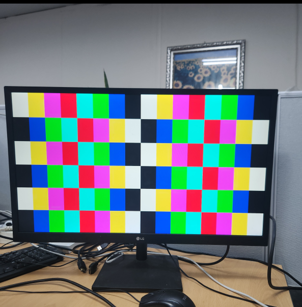
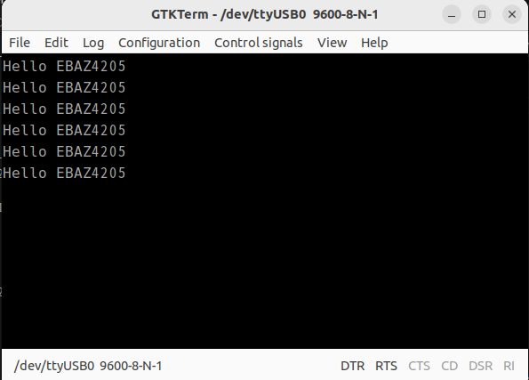

# NexEBAZ4205_hdmi_pattern

EBAZ4205 Zynq-7000 보드를 이용한 HDMI 720p 60Hz 컬러 패턴 출력 및 UART 통신 예제입니다.

## 주요 특징
- **입력 클럭**: 50MHz (HelloFPGA 확장 보드 N18 핀 기준)
- **HDMI 출력**: 1280x720 @ 60Hz (CEA-861 표준, Positive Polarity)
- **UART 통신**: 9600 Baud (50MHz 기준)
- **PS7 초기화**: XSDB 스크립트를 통한 PS7 초기화 루틴 포함

## 하드웨어 연결 및 결과

### HDMI 720p 패턴 출력 성공

### UART 9600bps 콘솔 출력 성공

## 실행 방법
1. 빌드: `make build`
2. 프로그래밍 및 PS 초기화: `make program_xsdb`
